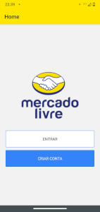
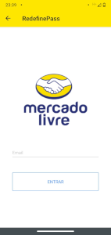
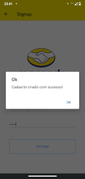
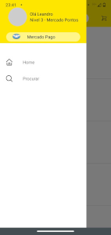
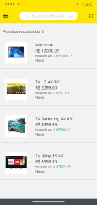

# 🚀Mercado Livre UI Clone

<a href="./LICENSE">

<a href="./">

---

 
 
 
 
 
 


## 📝Objetivo

- Clonar o aplicativo do Mercado Livre;
- Aplicar lições aprendidas em React-Native;
- Aprender Firebase;


## 🔎Instalação

Este projeto utiliza o [Expo](https://expo.io/).

Você precisará ter apenas o [NodeJS](https://nodejs.org) instalado na sua máquina, e após isso, clonar este repositório:
```sh
  $ git clone https://github.com/leandross86/Mercado_Livre_Clone_React-Native.git
```

Depois disso acesse o diretório e instale as dependências executando o seguinte comando:
```sh
  $ yarn install # ou npm install
```

## 📁Executando a aplicação

Execute o comando a baixo para inicializar o Expo:
```sh
  $ yarn start # ou npm start
```

Agora basta abrir o emulador pelo seu computador, ou o aplicativo do Expo no seu celular (disponível na [App Store](https://apps.apple.com/br/app/expo-client/id982107779) e na [Google Play](https://play.google.com/store/apps/details?id=host.exp.exponent&hl=pt_BR)).

## 🤝 Créditos

[Digital Innovation One](https://web.digitalinnovation.one/home)

[Paulo Henrique](https://www.linkedin.com/in/pablohdev/)

## 🧱Status: Em desenvolvimento

Desenvolvido com ❤ por Leandro Souza